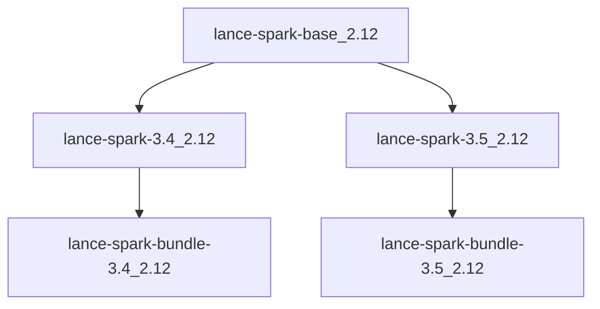

# Multi-Version Support

The Apache Spark Connector for Lance supports multiple versions of Spark and Scala through Maven build profiles. This guide explains how to work with different versions.

## Supported Versions

### Spark Versions

| Version | Status | Profile | Module |
|---------|--------|---------|--------|
| Spark 3.4 | ✅ Supported | `spark-3.4` | `lance-spark-3.4_2.12` |
| Spark 3.5 | ✅ Supported (Default) | `spark-3.5` | `lance-spark-3.5_2.12` |

### Scala Versions

| Version | Status | Profile | Notes |
|---------|--------|---------|-------|
| Scala 2.12 | ✅ Supported (Default) | `scala-2.12` | Primary supported version |
| Scala 2.13 | 🚧 In Development | `scala-2.13` | Experimental support |

## Build Profiles

### Using Spark Profiles

#### Build for Spark 3.4

```bash
./mvnw clean install -Pspark-3.4
```

#### Build for Spark 3.5 (Default)

```bash
./mvnw clean install -Pspark-3.5
# or simply
./mvnw clean install
```

### Using Scala Profiles

#### Build for Scala 2.12 (Default)

```bash
./mvnw clean install -Pscala-2.12
# or simply
./mvnw clean install
```

#### Build for Scala 2.13

```bash
./mvnw clean install -Pscala-2.13
```

### Combining Profiles

You can combine Spark and Scala profiles:

```bash
# Spark 3.4 with Scala 2.13
./mvnw clean install -Pspark-3.4,scala-2.13

# Spark 3.5 with Scala 2.12 (default combination)
./mvnw clean install -Pspark-3.5,scala-2.12
```

## Building Specific Modules

### Build Only Spark 3.4 Module

```bash
./mvnw clean install -Pspark-3.4 -pl lance-spark-3.4_2.12 -am
```

### Build Only Spark 3.5 Module

```bash
./mvnw clean install -Pspark-3.5 -pl lance-spark-3.5_2.12 -am
```

### Build Bundled JAR for Specific Version

```bash
# Bundled JAR for Spark 3.4
./mvnw clean install -Pspark-3.4 -Pshade-jar -pl lance-spark-bundle-3.4_2.12 -am

# Bundled JAR for Spark 3.5
./mvnw clean install -Pspark-3.5 -Pshade-jar -pl lance-spark-bundle-3.5_2.12 -am
```

## Project Structure

The multi-version support is implemented through separate Maven modules:

```
lance-spark/
├── lance-spark-base_2.12/          # Shared code
├── lance-spark-3.4_2.12/           # Spark 3.4 specific
├── lance-spark-3.5_2.12/           # Spark 3.5 specific
├── lance-spark-bundle-3.4_2.12/    # Bundled JAR for Spark 3.4
├── lance-spark-bundle-3.5_2.12/    # Bundled JAR for Spark 3.5
└── pom.xml                         # Parent POM with profiles
```

### Module Dependencies



## Version-Specific Code

### Handling API Differences

Different Spark versions may have API differences. These are handled through:

1. **Shared Base Module**: Common code in `lance-spark-base_2.12`
2. **Version-Specific Modules**: Version-specific implementations
3. **Conditional Compilation**: Using Maven profiles to include/exclude code

### Example: Version-Specific Implementation

```java
// In lance-spark-base_2.12
public abstract class BaseLanceDataSource {
    public abstract Dataset<Row> createDataset(SparkSession spark);
}

// In lance-spark-3.4_2.12
public class LanceDataSource34 extends BaseLanceDataSource {
    @Override
    public Dataset<Row> createDataset(SparkSession spark) {
        // Spark 3.4 specific implementation
        return spark.read().format("lance").load();
    }
}

// In lance-spark-3.5_2.12
public class LanceDataSource35 extends BaseLanceDataSource {
    @Override
    public Dataset<Row> createDataset(SparkSession spark) {
        // Spark 3.5 specific implementation with new APIs
        return spark.read().format("lance").option("newFeature", true).load();
    }
}
```

## Testing Multi-Version Support

### Test All Versions

```bash
# Test all supported combinations
./mvnw clean test -Pspark-3.4,scala-2.12
./mvnw clean test -Pspark-3.5,scala-2.12
./mvnw clean test -Pspark-3.4,scala-2.13
./mvnw clean test -Pspark-3.5,scala-2.13
```

### Version-Specific Tests

```bash
# Test only Spark 3.4
./mvnw clean test -Pspark-3.4 -pl lance-spark-3.4_2.12

# Test only Spark 3.5
./mvnw clean test -Pspark-3.5 -pl lance-spark-3.5_2.12
```

## Deployment Artifacts

### Maven Central Artifacts

Each version combination produces separate artifacts:

| Artifact | Spark Version | Scala Version |
|----------|---------------|---------------|
| `lance-spark-3.4_2.12` | 3.4 | 2.12 |
| `lance-spark-3.5_2.12` | 3.5 | 2.12 |
| `lance-spark-bundle-3.4_2.12` | 3.4 | 2.12 |
| `lance-spark-bundle-3.5_2.12` | 3.5 | 2.12 |

### Version Selection

Choose the artifact that matches your environment:

```xml
<!-- For Spark 3.4 with Scala 2.12 -->
<dependency>
    <groupId>com.lancedb.lance</groupId>
    <artifactId>lance-spark-bundle-3.4_2.12</artifactId>
    <version>0.0.1</version>
</dependency>

<!-- For Spark 3.5 with Scala 2.12 -->
<dependency>
    <groupId>com.lancedb.lance</groupId>
    <artifactId>lance-spark-bundle-3.5_2.12</artifactId>
    <version>0.0.1</version>
</dependency>
```

## Adding New Version Support

### Adding a New Spark Version

1. **Create new module directory**:
   ```bash
   mkdir lance-spark-3.6_2.12
   mkdir lance-spark-bundle-3.6_2.12
   ```

2. **Add module POM files** with appropriate Spark dependencies

3. **Update parent POM** to include new modules and profiles

4. **Implement version-specific code** if needed

5. **Add CI configuration** for the new version

### Profile Configuration Example

```xml
<profile>
    <id>spark-3.6</id>
    <properties>
        <spark.version>3.6.0</spark.version>
        <spark.major.version>3.6</spark.major.version>
    </properties>
    <modules>
        <module>lance-spark-3.6_2.12</module>
        <module>lance-spark-bundle-3.6_2.12</module>
    </modules>
</profile>
```

## Best Practices

### 1. Keep Shared Code in Base Module

Put common functionality in `lance-spark-base_2.12`:

```java
// Good: In base module
public class LanceUtils {
    public static boolean isValidPath(String path) {
        return path != null && !path.isEmpty();
    }
}
```

### 2. Minimize Version-Specific Code

Only create version-specific implementations when necessary:

```java
// Only when APIs differ between versions
public interface VersionSpecificHandler {
    void handleDataSource(DataSourceV2 source);
}
```

### 3. Use Consistent Naming

Follow naming conventions for modules and classes:

- Modules: `lance-spark-{version}_{scala-version}`
- Classes: `LanceDataSource{MajorVersion}{MinorVersion}`

### 4. Test All Combinations

Ensure all version combinations are tested:

```bash
# Test matrix
for spark in 3.4 3.5; do
    for scala in 2.12 2.13; do
        ./mvnw clean test -Pspark-$spark,scala-$scala
    done
done
```

## Troubleshooting

### Common Issues

#### 1. Wrong Artifact Version

**Problem**: Using Spark 3.5 artifact with Spark 3.4

**Solution**: Ensure artifact version matches your Spark version:
```xml
<!-- Wrong -->
<artifactId>lance-spark-bundle-3.5_2.12</artifactId>

<!-- Correct for Spark 3.4 -->
<artifactId>lance-spark-bundle-3.4_2.12</artifactId>
```

#### 2. Profile Not Activated

**Problem**: Building without specifying profile

**Solution**: Always specify the target profile:
```bash
# Instead of
./mvnw clean install

# Use
./mvnw clean install -Pspark-3.4
```

#### 3. Dependency Conflicts

**Problem**: Multiple Spark versions in classpath

**Solution**: Use dependency management to exclude conflicts:
```xml
<dependency>
    <groupId>com.lancedb.lance</groupId>
    <artifactId>lance-spark-bundle-3.5_2.12</artifactId>
    <version>0.0.1</version>
    <exclusions>
        <exclusion>
            <groupId>org.apache.spark</groupId>
            <artifactId>spark-core_2.12</artifactId>
        </exclusion>
    </exclusions>
</dependency>
```

## Next Steps

- [Building](building.md) - Learn how to build from source
- [Testing](testing.md) - Run tests for different versions
- [Contributing](contributing.md) - Contribute to multi-version support 